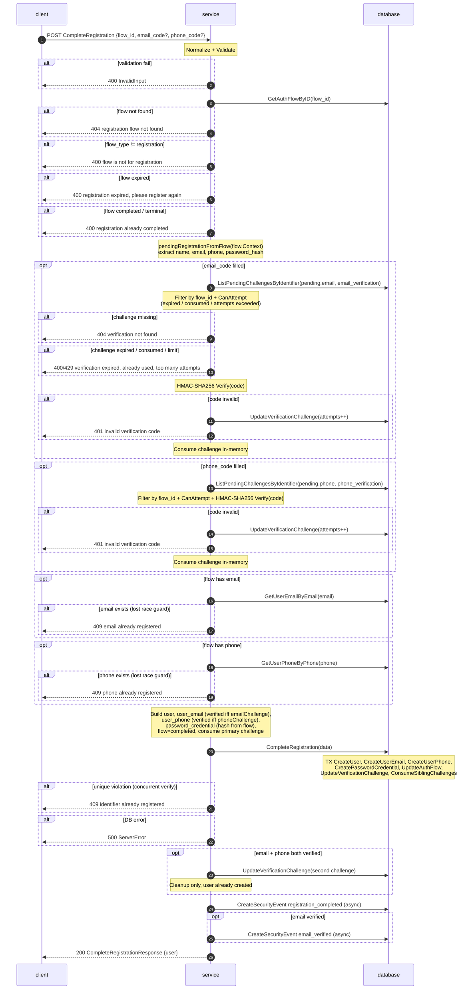

# Sequence Diagram — Endpoint CompleteRegistration

```mermaid
sequenceDiagram
    autonumber
    participant client
    participant service
    participant database

    client->>service: POST CompleteRegistration {flow_id, email_code?, phone_code?}

    Note over service: Normalize + Validate
    alt validation fail
        service-->>client: 400 InvalidInput
    end

    service->>database: GetAuthFlowByID(flow_id)
    alt flow not found
        service-->>client: 404 registration flow not found
    end
    alt flow_type != registration
        service-->>client: 400 flow is not for registration
    end
    alt flow expired
        service-->>client: 400 registration expired, please register again
    end
    alt flow completed / terminal
        service-->>client: 400 registration already completed
    end

    Note over service: pendingRegistrationFromFlow(flow.Context)<br/>extract name, email, phone, password_hash

    opt email_code filled
        service->>database: ListPendingChallengesByIdentifier(pending.email, email_verification)
        Note over service: Filter by flow_id + CanAttempt<br/>(expired / consumed / attempts exceeded)
        alt challenge missing
            service-->>client: 404 verification not found
        end
        alt challenge expired / consumed / limit
            service-->>client: 400/429 verification expired, already used, too many attempts
        end
        Note over service: HMAC-SHA256 Verify(code)
        alt code invalid
            service->>database: UpdateVerificationChallenge(attempts++)
            service-->>client: 401 invalid verification code
        end
        Note over service: Consume challenge in-memory
    end

    opt phone_code filled
        service->>database: ListPendingChallengesByIdentifier(pending.phone, phone_verification)
        Note over service: Filter by flow_id + CanAttempt + HMAC-SHA256 Verify(code)
        alt code invalid
            service->>database: UpdateVerificationChallenge(attempts++)
            service-->>client: 401 invalid verification code
        end
        Note over service: Consume challenge in-memory
    end

    opt flow has email
        service->>database: GetUserEmailByEmail(email)
        alt email exists (lost race guard)
            service-->>client: 409 email already registered
        end
    end
    opt flow has phone
        service->>database: GetUserPhoneByPhone(phone)
        alt phone exists (lost race guard)
            service-->>client: 409 phone already registered
        end
    end

    Note over service: Build user, user_email (verified iff emailChallenge),<br/>user_phone (verified iff phoneChallenge),<br/>password_credential (hash from flow),<br/>flow=completed, consume primary challenge

    service->>database: CompleteRegistration(data)
    Note over database: TX CreateUser, CreateUserEmail, CreateUserPhone,<br/>CreatePasswordCredential, UpdateAuthFlow,<br/>UpdateVerificationChallenge, ConsumeSiblingChallenges
    alt unique violation (concurrent verify)
        service-->>client: 409 identifier already registered
    end
    alt DB error
        service-->>client: 500 ServerError
    end

    opt email + phone both verified
        service->>database: UpdateVerificationChallenge(second challenge)
        Note over service: Cleanup only, user already created
    end

    service->>database: CreateSecurityEvent registration_completed (async)
    opt email verified
        service->>database: CreateSecurityEvent email_verified (async)
    end

    service-->>client: 200 CompleteRegistrationResponse {user}
```
