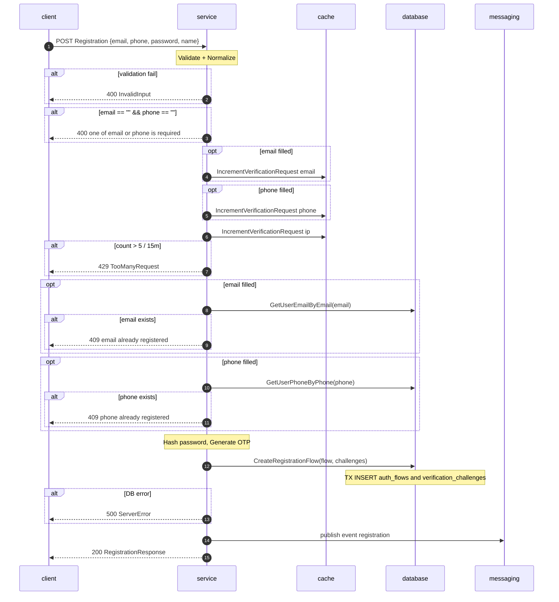

# Sequence Diagram — Endpoint Registration

```mermaid
sequenceDiagram
    autonumber
    participant client
    participant service
    participant cache
    participant database
    participant messaging

    client->>service: POST Registration {email, phone, password, name}

    Note over service: Validate + Normalize
    alt validation fail
        service-->>client: 400 InvalidInput
    end
    alt email == "" && phone == ""
        service-->>client: 400 one of email or phone is required
    end

    opt email filled
        service->>cache: IncrementVerificationRequest email
    end
    opt phone filled
        service->>cache: IncrementVerificationRequest phone
    end
    service->>cache: IncrementVerificationRequest ip
    alt count > 5 / 15m
        service-->>client: 429 TooManyRequest
    end

    opt email filled
        service->>database: GetUserEmailByEmail(email)
        alt email exists
            service-->>client: 409 email already registered
        end
    end
    opt phone filled
        service->>database: GetUserPhoneByPhone(phone)
        alt phone exists
            service-->>client: 409 phone already registered
        end
    end

    Note over service: Hash password, Generate OTP
    service->>database: CreateRegistrationFlow(flow, challenges)
    Note over database: TX INSERT auth_flows and verification_challenges

    alt DB error
        service-->>client: 500 ServerError
    end

    service->>messaging: publish event registration
    service-->>client: 200 RegistrationResponse
```
